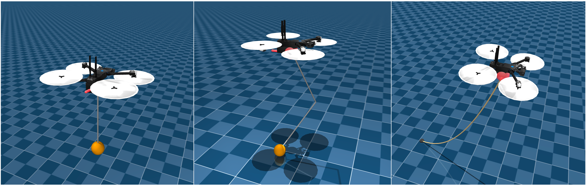
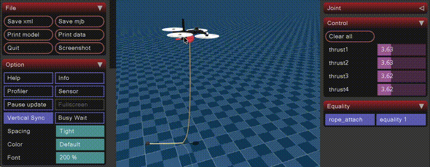

# CabledDrone



A [MuJoCo](https://mujoco.org) simulation of a [Skydio X2](https://www.skydio.com/skydio-x2) quadrotor linked to the world by cables. It goes step by step from open-loop hover to altitude hold and position control, then flies with a rigid single and double spherical pendulum hanging below, a flexible rope lifted from the ground, and a rope tethered to the ground that limits how far the drone can go. Everything is driven by a cascaded geometric controller written from scratch, with an anti-windup tuned for unknown loads.

The drone model (`x2.xml`, `scene.xml`, `assets/`) comes from [MuJoCo Menagerie](https://github.com/google-deepmind/mujoco_menagerie/tree/main/skydio_x2) (see [License](#license)).

<p align="center">
  
  <br>
  <em>Case 7: the target (red sphere) is dragged around in the viewer; the drone follows it within the reach of the rope tethered to the ground.</em>
</p>

## Installation

Dependencies are managed with [uv](https://docs.astral.sh/uv/):

```bash
git clone https://github.com/elcocogo/CabledDrone.git
cd CabledDrone
uv sync
```

> **macOS:** the viewer requires `mjpython` instead of `python` (otherwise: `RuntimeError: launch_passive requires that the Python script be run under mjpython on macOS`). On Linux/Windows, replace `mjpython` with `python` in all the commands below.

## Case studies

Each case builds on the previous one. All results below were measured headless (no viewer), with the scripted scenario described in each section.

| # | Case | Command |
|---|------|---------|
| 1 | Open-loop hover / free fall | `uv run mjpython sim.py` · `uv run mjpython sim.py --controller off` |
| 2 | Altitude hold | `uv run mjpython sim.py --controller altitude` |
| 3 | Position and heading control | `uv run mjpython sim.py --controller position` |
| 4 | Position control + suspended load (single pendulum) | `uv run mjpython sim.py --controller position --payload` |
| 5 | Position control + double pendulum | `uv run mjpython sim.py --controller position --payload --rod-count 2` |
| 6 | Position control + flexible rope lifted from the ground | `uv run mjpython sim.py --controller position --rope` |
| 7 | Position control + rope tethered to a fixed point on the ground | `uv run mjpython sim.py --controller position --rope --rope-anchor` |

### 1. Open-loop hover and free fall

The drone starts at 0.3 m. `hover` (default) applies the constant thrust of the `hover` keyframe, which exactly balances the drone's weight. There is no feedback at all: the drone stays still only as long as nothing disturbs it. `off` cuts the motors.

```bash
uv run mjpython sim.py                    # hover
uv run mjpython sim.py --controller off   # motors off: the drone falls
```

**Try in the viewer:** push the drone (see [Viewer controls](#viewer-controls)). It drifts away and never comes back.

### 2. Altitude hold

A PID on total thrust, split equally across the 4 rotors: thrust = m · (g + kp·e + ki·∫e + kd·(v_ref − v)). The gravity term is fed forward, so the PID only corrects the error. The setpoint ramps toward the target at 0.5 m/s instead of jumping, which keeps the integral term from winding up during a long climb.

```bash
uv run mjpython sim.py --controller altitude                       # target 1 m
uv run mjpython sim.py --controller altitude --target-altitude 2   # target 2 m
```

**Try in the viewer:** pull the drone up or down; it returns to the target altitude.

**Limitation:** only altitude is controlled. If you tilt the drone (Ctrl + left-drag), it stays tilted and drifts sideways.

**Measured:** 0.3 m → 1 m with ~6 cm overshoot, within 2 cm of the target after ~2.5 s. A sustained 5 N downward push (~40 % of the drone's weight) drops it by ~35 cm; the integral term then brings it back.

### 3. Position and heading control

A cascaded controller (`PositionController` in `sim.py`), structured like real autopilots: a reference generator and a position PID compute the acceleration the drone needs; that acceleration sets the total thrust and the attitude the drone must take (it moves sideways by tilting); an attitude controller computes the torques to reach that attitude; a mixer converts thrust and torques into the 4 rotor thrusts. The same controller is used in cases 3 to 7. See [Position controller in detail](#position-controller-in-detail) for the equations, the structure of the cascade, the mixing matrix and the anti-windup of the integral term.

The target is the red sphere (the line shows the target heading). It is a mocap body: you can move it live in the viewer and the drone follows.

```bash
uv run mjpython sim.py --controller position                            # target starts at (0, 0, 1)
uv run mjpython sim.py --controller position --target-position 2 1 1.5  # choose where the target starts
```

**Try in the viewer:** double-click the red sphere, then Ctrl + right-drag to move it, Ctrl + left-drag to rotate it. Push or tilt the drone; it recovers.

**Measured** (scenario: go to (2, 1, 1.5) → 90° heading change at 8 s → 3 N sideways push from 12 to 14 s → go to (−1, −1, 1.5) at 16 s):

- 0.3 m → (2, 1, 1.5) in ~3 s, 1 cm overshoot, 1 mm steady-state error.
- 90° heading change in ~2 s without losing altitude.
- The sideways push moves it by ~35 cm, then it comes back.
- Tilt stays under 21° (limit 30°).

### 4. Suspended load: single spherical pendulum

`--payload` hangs a rod (0.5 m, 20 g) ending in a sphere (0.3 kg by default) under the drone. The rod is attached by a ball joint (3 free rotations, no damping), ~5 cm below the drone's center of mass. The payload is added in Python with `MjSpec` (`add_payload` in `sim.py`), so `x2.xml` stays unchanged.

**The controllers are not told about the payload.** They use the drone's mass only, and the integral term has to discover and compensate the extra weight. As a result, heavier loads sag at takeoff and the sphere may briefly touch the ground before the drone lifts it.

```bash
uv run mjpython sim.py --controller position --payload                                  # 0.3 kg, 0.5 m rod
uv run mjpython sim.py --controller position --payload --payload-mass 0.8               # heavier load
uv run mjpython sim.py --controller position --payload --rod-length 1 --target-position 0 0 1.6
```

With a payload, the drone starts higher so the sphere clears the ground (by 10 cm), and the default target is raised to at least the load length + 0.4 m. If you set `--target-position` yourself, keep its altitude above the load length (rod lengths + 5 cm), otherwise the sphere hits the ground.

**Try in the viewer:** move the target quickly and watch the load swing; push the sphere itself.

**Measured** (same scenario as case 3, flying at load length + 0.4 m):

| Load | Result |
|---|---|
| 0.3 kg | Within ~1.5 cm of the target; rod swings up to ~21° during moves and settles back to vertical |
| 0.8 kg | Slower climb (6 cm off after 8 s, ~2 cm after 12 s); rod swings up to ~40° |
| 1.5 kg | Slow: 35 cm off after 8 s, ~1 cm at the end; rod swings up to ~54° |
| 3.0 kg | Never fully lifts the sphere off the ground, stays ~45 cm off target. The motors are not saturated: the integral term alone is too slow for such an unknown load |

### 5. Double spherical pendulum

`--rod-count 2` adds an intermediate rod: drone → ball joint → rod → ball joint → rod → sphere. Both rods have the given length (0.5 m each by default, so the load hangs 1.05 m below the drone). A double pendulum is chaotic: the two rods swing out of phase, and the drone feels their combined pull. `--rod-count` accepts any number of rods.

```bash
uv run mjpython sim.py --controller position --payload --rod-count 2                     # 2 × 0.5 m, 0.3 kg
uv run mjpython sim.py --controller position --payload --rod-count 2 --payload-mass 0.8
uv run mjpython sim.py --controller position --payload --rod-count 2 --rod-length 0.3    # shorter, faster swings
```

**Try in the viewer:** double-click the intermediate rod and Ctrl + right-drag it to excite the chaotic motion, then let the controller settle it.

**Measured** (same scenario, swing = angle of each rod from vertical):

| Load | Result |
|---|---|
| 2 × 0.5 m, 0.3 kg | Within ~2 cm of the target; rods swing up to ~15° and ~16°, with a few degrees of residual swing |
| 2 × 0.5 m, 0.8 kg | 6 cm off after 8 s, ~1 cm after 12 s; rods swing up to ~31° and ~33° |
| 2 × 0.5 m, 1.5 kg | Slow, ~3 cm off at the end; rods swing up to ~41° and ~44° |
| 2 × 0.3 m, 0.3 kg | Within ~1–3 cm; rods swing up to ~19° and ~20° |

**Simulation timestep.** With a payload, the timestep drops from 0.01 s (the value in `x2.xml`) to 0.002 s (`PayloadParams.timestep`). A thin rod has almost no inertia around its own axis (~2.5·10⁻⁷ kg·m²). The intermediate rod, with no sphere to weigh it down, made the simulation blow up at 0.01 s (NaN, drone flipped over as soon as the load reached 0.8 kg). Adding artificial inertia to the joints (`armature`) would also have fixed it, but would have changed the pendulum's physics. Without a payload, the timestep stays at 0.01 s.

### 6. Flexible rope

`--rope` attaches a flexible rope (1 m, 0.2 kg by default) under the drone, with no weight at its end: its mass is spread evenly along its length. At start, the rope hangs from the drone down to the ground and the rest of it lies on the ground. The drone lifts it off as it climbs to the target.

**How the rope is modeled.** A 1D `flexcomp`: a chain of point masses (21 by default) with no orientation, linked by segments of fixed length (`<edge equality="true"/>`). The rope therefore has no bending or twisting stiffness at all: it folds freely, like a real rope. It collides with the ground (it rests on it and drags on it at takeoff).

**How it is attached.** A point attachment (`connect` equality: the rope's first point is pinned to a point 1 cm under the drone, 3 translations blocked, no rotation), like a knot. It transmits only tension, never a torque. A ball joint would add one more degree of freedom: the rotation of the rope around its own axis. That rotation means nothing for a rope, has almost zero inertia, and is what made the rigid double pendulum blow up at 0.01 s (case 5).

```bash
uv run mjpython sim.py --controller position --rope                        # 1 m, 0.2 kg
uv run mjpython sim.py --controller position --rope --rope-mass 0.5        # heavier rope
uv run mjpython sim.py --controller position --rope --rope-length 2        # longer rope (target raised to 2.4 m)
uv run mjpython sim.py --controller position --rope --rope-points 41       # finer rope (smoother bending)
```

Use the `position` controller. `hover` and `altitude` don't control attitude: as the rope still lying on the ground pulls sideways at takeoff, it tilts the drone, which then flips over.

**Try in the viewer:** move the target quickly and watch the rope trail behind and fold; grab a point in the middle of the rope (double-click it, Ctrl + right-drag) and pull it.

**Measured** (scenario: take off toward the default target at rope length + 0.4 m → go to (2, 1, same height) at 8 s → come back at 14 s → end at 24 s):

| Rope | Fully lifted off the ground after | Drone error at 8 s / at the end | Max rope stretch |
|---|---|---|---|
| 1 m, 0.2 kg, 21 points | 1.4 s | 1 cm / 1 mm | 0.15 % |
| 1 m, 0.5 kg | 1.7 s | 3 cm / 1 mm | 0.17 % |
| 2 m, 0.2 kg | 2.4 s | 1 cm / 1 mm | 0.10 % |
| 1 m, 0.2 kg, 41 points | 1.3 s | 1 cm / 1 mm | 0.37 % |

The drone tilts up to ~8° and never touches the rope. Simulation cost is ~80 µs per step (budget: 2 ms per step in real time).

**Tuning, and the problems it solved** (all in `RopeParams` in `sim.py`):

- **Stiffer constraints** (`solref`, `solimp`). MuJoCo constraints are soft, and their stiffness scales with the masses involved. With the default values, the first segment, which carries the weight of the whole rope through a 10 g point, stretched by 8 %. With the values used, stretch stays under 0.4 %. They require a 0.002 s timestep, set automatically with `--rope`.
- **Air drag** (`drag`, 0.1 N·s/m per meter of rope, applied to each point). Without it, the rope kept swinging forever. With it, a swing dies out in a few seconds.
- **Initial shape.** The rest length of each segment is taken from the initial shape, so all segments must have the same length in it: the segment at the corner between the hanging part and the part on the ground goes down diagonally.

### 7. Rope tethered to the ground

`--rope-anchor` pins the rope's far end to the ground, where it lies at start (marked by a small dark post). The rope is longer by default in this case: 2 m instead of 1 m, to leave room to fly around. The drone can no longer move further than one rope length from the anchor: its reachable space is a hemisphere of radius 2 m centered on the anchor. The default target is placed halfway between the drone and the anchor, 1 m high; a target straight above the drone's start would already be out of reach.

The anchor is a `<pin>` on the last point of the `flexcomp`: that point gets no body and is fixed to the world.

```bash
uv run mjpython sim.py --controller position --rope --rope-anchor                     # 2 m rope
uv run mjpython sim.py --controller position --rope --rope-anchor --rope-length 3     # 3 m rope, larger radius
```

**Try in the viewer:** drag the target far away from the anchor. The rope goes taut and the drone stops at the edge of the hemisphere, leaning against the rope; move the target back within reach and the drone follows it again. Drag the target straight up above the anchor: the drone stops one rope length above it.

**Measured** (2 m rope: default target → reachable target 1.6 m from the anchor → unreachable target 4 m away horizontally → unreachable target 3.5 m above the anchor → back to a reachable target, 8 s each):

| Phase | Result |
|---|---|
| Reachable targets | Reached within ~1 cm; tilt under 9° |
| Unreachable, horizontal | Drone held at 2.003–2.006 m from the anchor (rope length 2 m), on the line toward the target; tilt up to ~44° (the taut rope pulls on the drone below its center of mass, which overrides the 30° tilt limit) |
| Unreachable, vertical | Drone held 2 m above the anchor, motors at full thrust (52 N) without losing attitude control |
| Back within reach | 3 cm from the target after 8 s (1 cm with a 3 m rope) |

Rope stretch stays under 0.5 % even when pulled taut at full thrust.

## Position controller in detail

This is the `position` controller (`PositionController` in `sim.py`), as used in all cases from 3 on. Its last additions (mixer saturation priorities, anti-windup of the integral term) came from case 7, where a tethered rope can hold the drone away from its target.

Notation: $p$, $v$ position and velocity of the drone (world frame); $R$ its orientation (rotation matrix whose columns are the body axes $x_B, y_B, z_B$ in the world frame); $\omega$ its angular velocity (body frame); $m = 1.325$ kg the mass **of the drone alone** and $J$ its inertia tensor (body frame). The payload or the rope are never known to the controller. All quantities are read directly from the simulator (`data.qpos`, `data.qvel`, `data.xmat`), not from the IMU sensors.

### Structure of the cascade

```
target position + heading ψ (red mocap sphere)
        │
        ▼
┌─────────────────────────┐
│ 1. Reference generator  │  state: p_ref, v_ref
└─────────────────────────┘
        │ p_ref, v_ref, a_ref
        ▼
┌─────────────────────────┐ ◄── p, v (measured)
│ 2. Position PID         │  state: integral I
└─────────────────────────┘ ◄── thrust_saturated (from 5, previous step)
        │ a_cmd (desired acceleration, world frame)
        ▼
┌─────────────────────────┐ ◄── R (measured), ψ (target heading)
│ 3. Thrust and attitude  │
│    setpoint             │
└─────────────────────────┘
        │ T (total thrust)          R_d (desired attitude)
        │                                │
        │                                ▼
        │                  ┌─────────────────────────┐ ◄── R, ω (measured)
        │                  │ 4. Attitude PD          │
        │                  └─────────────────────────┘
        │                                │ τ = (τx, τy, τz)
        ▼                                ▼
┌──────────────────────────────────────────────────┐
│ 5. Mixer (allocation matrix + saturation rules)  │ ──► thrust_saturated (to 2)
└──────────────────────────────────────────────────┘
        │ f1, f2, f3, f4 (rotor thrusts, N) → data.ctrl
        ▼
     MuJoCo
```

| Stage | Inputs | Outputs | Code |
|---|---|---|---|
| 1. Reference generator | target position (mocap body `target`); current position $p$ (first call only) | reference position $p_{ref}$, velocity $v_{ref}$, acceleration $a_{ref}$ | `update_reference` |
| 2. Position PID | $p_{ref}, v_{ref}, a_{ref}$; measured $p, v$; saturation flag from stage 5 | desired acceleration $a_{cmd}$ (world frame, gravity included, tilt-limited) | `__call__`, step 1 |
| 3. Thrust and attitude setpoint | $a_{cmd}$; measured $R$; target heading $\psi$ (mocap orientation) | total thrust $T$ (N); desired attitude $R_d$ | `__call__`, step 2 |
| 4. Attitude PD | $R_d$; measured $R, \omega$ | torques $\tau$ (N·m, body frame) | `__call__`, step 3 |
| 5. Mixer | $T, \tau$ | rotor thrusts $f_1 \dots f_4$ (N); flag `thrust_saturated` | `mix` |

Every stage runs at every simulation step, but the loops have very different speeds: the attitude loop (natural frequency $\sqrt{k_R} = 10$ rad/s) is about 4× faster than the position loop ($\sqrt{k_{p,xy}} \approx 2.5$ rad/s). This separation is what makes the cascade work: the position loop assumes that the attitude it requests is reached almost instantly.

### Stage 1: reference generator

The target can jump (it is dragged in the viewer). Following it directly would flip the drone, so a reference point moves toward it with bounded speed and acceleration ($v_{max} = 1$ m/s, $a_{max} = 1$ m/s²), slowing down near the target so it stops exactly there. With $d$ the distance from $p_{ref}$ to the target and $u$ the direction toward it:

$$v_{wanted} = \min\left(v_{max}, \sqrt{2\, a_{max}\, d}\right) u, \qquad \|\Delta v_{ref}\| \le a_{max}\, \Delta t, \qquad a_{ref} = \frac{\Delta v_{ref}}{\Delta t}$$

$a_{ref}$ is passed to the PID as a feedforward term: without it, the drone lagged behind the reference's speed changes and overshot the target by ~20 cm.

### Stage 2: position PID

One PID per axis, with $e = p_{ref} - p$ and $I$ the integral of $e$ (see [anti-windup](#integral-term-and-anti-windup) below):

$$a_{cmd} = a_{ref} + K_p\, e + K_i\, I + K_d\,(v_{ref} - v) + g\, \hat z$$

with $K_p = (6, 6, 9)$, $K_i = (0.5, 0.5, 3)$, $K_d = (5, 5, 6)$ for $(x, y, z)$. Gains are accelerations, so they don't depend on the drone's mass. The derivative term acts on the velocity error rather than on the derivative of $e$, to avoid a kick when the reference changes. $g\,\hat z$ compensates the drone's weight (feedforward).

$a_{cmd}$ is then limited: $a_{cmd,z} \ge 0.2\, g$ (always push upward a little), and $\|a_{cmd,xy}\| \le a_{cmd,z} \tan(30°)$, so the attitude requested in stage 3 never tilts more than 30°.

### Stage 3: thrust and attitude setpoint

A quadrotor can only push along its own $z_B$ axis. To accelerate along $a_{cmd}$, it must tilt $z_B$ toward $a_{cmd}$. The total thrust is the projection of the required force on the current $z_B$, and the desired attitude $R_d$ has its $z$ axis along $a_{cmd}$ and its $x$ axis as close as possible to the target heading $\psi$:

$$T = m\, a_{cmd} \cdot z_B, \qquad z_d = \frac{a_{cmd}}{\|a_{cmd}\|}, \qquad y_d = \frac{z_d \times x_c}{\|z_d \times x_c\|} \text{ with } x_c = (\cos\psi, \sin\psi, 0), \qquad x_d = y_d \times z_d$$

$$R_d = \begin{bmatrix} x_d & y_d & z_d \end{bmatrix}$$

### Stage 4: attitude PD

Geometric controller on SO(3) (Lee, Leok and McClamroch, 2010). Unlike a PID on Euler angles, it has no singularity and stays valid at large tilts:

$$e_R = \tfrac{1}{2}\left(R_d^\top R - R^\top R_d\right)^\vee, \qquad \tau = J\left(-k_R\, e_R - k_\omega\, \omega\right) + \omega \times J\omega$$

with $k_R = 100$, $k_\omega = 20$. $(\cdot)^\vee$ maps a skew-symmetric matrix to its vector. $J$ is taken from the model (MuJoCo stores it diagonalized in a rotated frame, `body_iquat`, that the controller rotates back to the body frame). The last term compensates the gyroscopic coupling. This loop has no integral term.

### Stage 5: mixer and allocation matrix A

Each rotor $i$ produces a thrust $f_i$ along $z_B$, applied at a point $(x_i, y_i)$ relative to the center of mass. By $r \times F$, it creates a roll torque $y_i f_i$ and a pitch torque $-x_i f_i$. The spinning propeller also creates a reaction torque around $z_B$, $k_i f_i$, whose sign alternates between rotors (6th component of `gear` in `x2.xml`). Stacking the 4 rotors gives the allocation matrix $A$, which maps rotor thrusts to the total thrust and the 3 torques (body frame):

$$\begin{bmatrix} T \\ \tau_x \\ \tau_y \\ \tau_z \end{bmatrix} = A \begin{bmatrix} f_1 \\ f_2 \\ f_3 \\ f_4 \end{bmatrix}, \qquad A = \begin{bmatrix} 1 & 1 & 1 & 1 \\ y_1 & y_2 & y_3 & y_4 \\ -x_1 & -x_2 & -x_3 & -x_4 \\ k_1 & k_2 & k_3 & k_4 \end{bmatrix} = \begin{bmatrix} 1 & 1 & 1 & 1 \\ -0.18 & 0.18 & 0.18 & -0.18 \\ 0.14 & 0.14 & -0.14 & -0.14 \\ -0.0201 & 0.0201 & -0.0201 & 0.0201 \end{bmatrix}$$

| Rotor | Position | $x_i$ (m) | $y_i$ (m) | $k_i$ (N·m/N) |
|---|---|---|---|---|
| 1 | rear right | −0.14 | −0.18 | −0.0201 |
| 2 | rear left | −0.14 | +0.18 | +0.0201 |
| 3 | front left | +0.14 | +0.18 | −0.0201 |
| 4 | front right | +0.14 | −0.18 | +0.0201 |

($x$ forward, $y$ to the left, $z$ up; the center of mass is centered in $x, y$.) `allocation_matrix` builds $A$ from the rotor sites and `gear` in the model, so it follows any change made to `x2.xml`.

Because the rotors are symmetric, the inverse has a simple closed form: each rotor takes a quarter of each command, divided by its own lever arm.

$$f_i = \frac{1}{4}\left(T + \frac{\tau_x}{y_i} - \frac{\tau_y}{x_i} + \frac{\tau_z}{k_i}\right), \qquad A^{-1} = \begin{bmatrix} 0.25 & -1.39 & 1.79 & -12.4 \\ 0.25 & 1.39 & 1.79 & 12.4 \\ 0.25 & 1.39 & -1.79 & -12.4 \\ 0.25 & -1.39 & -1.79 & 12.4 \end{bmatrix}$$

The last column shows how weak the yaw authority is: 1 N·m of yaw needs ±12.4 N per rotor, against ±1.4 N for roll.

**Saturation priorities.** Rotor thrusts are limited to $[0, 13]$ N. When the commands can't all be met, the mixer gives up the least important ones first:

1. Roll/pitch before total thrust. Compute $f = A^{-1}[T, \tau_x, \tau_y, 0]^\top$. If a rotor exceeds 13 N, lower all rotors by the same amount (this lowers $T$ by $\Delta T$ and keeps the differences between rotors, hence the torques):
   $$\Delta T = \max_i \frac{f_i - 13}{1/4}, \qquad f \leftarrow f - \frac{\Delta T}{4} \quad \text{if } \Delta T > 0$$
   In that case the mixer also sets the `thrust_saturated` flag, used by the anti-windup in stage 2. Clipping each rotor on its own destroyed those differences: pulling with all its strength on a tethered rope, the drone stayed stuck at a 43° tilt.
2. Thrust and roll/pitch before yaw. Compute the yaw part $f_\psi = A^{-1}[0, 0, 0, \tau_z]^\top$ and add the largest fraction $s \in [0, 1]$ of it that keeps every rotor in $[0, 13]$ N: $f \leftarrow f + s\, f_\psi$. Without this, a 90° turn required negative thrusts, clipped to 0, which corrupted the total thrust and sent the drone up to 7 m.

### Integral term and anti-windup

The integral term compensates unknown persistent external forces $F_{ext}$, such as the weight of a payload or the tension of a rope. At equilibrium, it settles where it cancels them:

$$K_i\, I\, m \approx F_{ext} \quad\Rightarrow\quad I \approx \frac{F_{ext}}{K_i\, m}$$

The controller can't tell where $F_{ext}$ comes from: a tethered rope holding it back and a payload weighing it down are the same thing from its point of view. But when the target is out of reach, the error never vanishes and the integral keeps growing: this is integral windup. When the target becomes reachable again, the "full" integral pushes in the wrong direction until it empties.

Three mechanisms limit it. Per axis, at each step:

$$s = e\, \Delta t, \qquad s \leftarrow k_u\, s \;\text{ if }\; s \cdot I < 0, \qquad I_{new} = \operatorname{clip}\left(I + s,\; -I_{max},\; I_{max}\right), \qquad I \leftarrow \begin{cases} I & \text{if saturated} \\ I_{new} & \text{otherwise} \end{cases}$$

1. **Clamping** ($I_{max} = 6$ m·s, `integral_limit`). Bounds the external force the integral can compensate: $K_{i,z}\, I_{max}\, m = 3 \times 6 \times 1.325 \approx 24$ N on the vertical axis, about 2.4 kg of unknown load. With $I_{max} = 2$, the drone couldn't carry more than ~0.8 kg. This is the only safeguard of the simpler `altitude` controller ($I_{max} = 2$).
2. **Conditional integration.** While the command is saturated (horizontal acceleration clipped by the 30° tilt limit in stage 2, or `thrust_saturated` set by the mixer at the previous step), the integral is frozen: increasing it couldn't change what the drone does.
3. **Fast unwinding** ($k_u = 10$, `integral_unwind_gain`). When the error has the opposite sign of the integral ($e \cdot I < 0$), the situation that filled it is over (for instance, the target is reachable again). The integral then empties 10× faster than it filled. Since a rope and a payload can't be told apart, the integral can't be prevented from filling without losing the ability to carry heavy loads; only its emptying is sped up.

Why freezing alone wasn't enough in case 7: while the rope is taut, saturation is only intermittent. In between, the error stays at 1–2 m and the integral keeps growing up to its limit. When the target came back within reach, $I_z$ was at 5.3 (out of 6), and the drone was still ~60 cm off 8 s later. With fast unwinding, it is 3 cm off. Fast unwinding also helps elsewhere: when the drone overshoots, the error changes sign and the extra thrust is cut sooner, which brought the 1.5 kg payload from 10 cm to 5 cm of error after 12 s.

A tracking-error leash (bounding $\|p_{ref} - p\|$, another common technique) was tried and didn't help: it bounds the error, but the integral still grows as long as the error isn't zero.

## Viewer controls

- **Camera:** follows the drone. Scroll to zoom, left-drag to rotate. Press `Esc` for a fully free camera (right-drag to pan).
- **Push or pull a body** (drone, rod, sphere, rope point): double-click it, then Ctrl + right-drag. Ctrl + left-drag applies a torque.
- **Move the target** (red sphere): double-click it, then Ctrl + right-drag to move it, Ctrl + left-drag to rotate it (changes the target heading).

## Command-line options

| Option | Default | Description |
|---|---|---|
| `--controller {hover,off,altitude,position}` | `hover` | Control law |
| `--target-altitude Z` | 1.0 | Target altitude in m (`altitude` controller) |
| `--target-position X Y Z` | (0, 0, 1); raised to load length + 0.4 m with a payload or rope; halfway to the anchor with `--rope-anchor` | Initial target position in m (`position` controller); can then be moved in the viewer |
| `--payload` | off | Hang a load under the drone |
| `--rod-count N` | 1 | Number of rods linked by ball joints (1 = pendulum, 2 = double pendulum) |
| `--rod-length L` | 0.5 | Length of each rod in m |
| `--payload-mass M` | 0.3 | Mass of the sphere in kg |
| `--rope` | off | Attach a flexible rope under the drone (cannot be combined with `--payload`) |
| `--rope-anchor` | off | Pin the rope's far end to the ground (with `--rope`) |
| `--rope-length L` | 1.0 (2.0 with `--rope-anchor`) | Rope length in m |
| `--rope-mass M` | 0.2 | Total rope mass in kg, spread evenly |
| `--rope-points N` | 21 | Number of point masses in the rope |
| `-v`, `--verbose` | off | Print position and rotor thrusts at each step |

All controller gains, payload and rope settings are in the `AltitudePIDParams`, `PositionControllerParams`, `PayloadParams` and `RopeParams` dataclasses in `sim.py`. Gains are expressed as accelerations, so they don't depend on the drone's mass or inertia.

## Model

- **Drone:** a single free-floating body `x2` (6 DoF, `freejoint`), mass 1.325 kg.
- **Actuators:** 4 motors `thrust1`..`thrust4`, one per rotor, each producing a vertical thrust in `[0, 13]` N plus a yaw reaction torque (±0.0201 N·m per N of thrust, alternating direction).
- **Sensors:** `body_gyro` (angular velocity), `body_linacc` (linear acceleration) and `body_quat` (orientation), all at the `imu` site. The controllers don't use them yet: they read the exact state from the simulator.
- **Keyframe `hover`:** drone at 0.3 m with each rotor at 3.25 N, which exactly balances the drone's weight.
- **Target:** mocap body `target` in `scene.xml`, no collision.
- **Timestep:** 0.01 s (0.002 s with a payload or a rope).

## Adding a controller

Write a function (or a callable class, if it keeps state like `AltitudePID`) `(model, data) -> np.ndarray` returning the 4 rotor thrusts, and register a builder `(model, args) -> controller` in `CONTROLLERS` in `sim.py`. The drone's freejoint is always the first joint, so `data.qpos[:3]`, `data.qvel[:3]` and `data.qvel[3:6]` are the drone's position, linear velocity and angular velocity (body frame), with or without a payload.

## Project structure

```
.
├── sim.py       # entry point: model building (payload, rope), controllers, real-time loop
├── scene.xml    # MJCF scene (ground, lighting, skybox, target mocap body), includes x2.xml
├── x2.xml       # MJCF drone model (from mujoco_menagerie)
├── assets/      # drone mesh and texture
└── images/      # README banner and demo
```

## License

Released under the [Apache License 2.0](LICENSE).

The Skydio X2 model (`x2.xml`, `scene.xml` and `assets/`, modified here: target body added to the scene) comes from [MuJoCo Menagerie](https://github.com/google-deepmind/mujoco_menagerie/tree/main/skydio_x2). Its assets were provided by Skydio under the Apache License 2.0.
